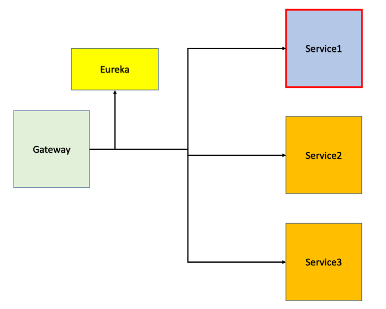

# gateway

### 1. service id,url,predicates 정리

        - id: service1
          uri: http://localhost:8015
          predicates:
          - Path=/services/**
        - id: service31
          uri: http://client.taskoo.net
          predicates:
            - Path=/client/**
        - id: gateway
          uri: http://localhost:9001
          predicates:
            - Path=/gateway/**